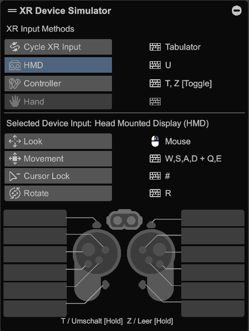
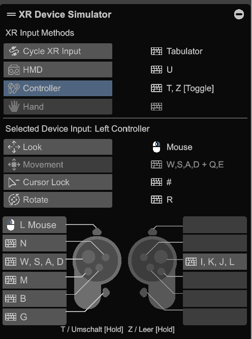
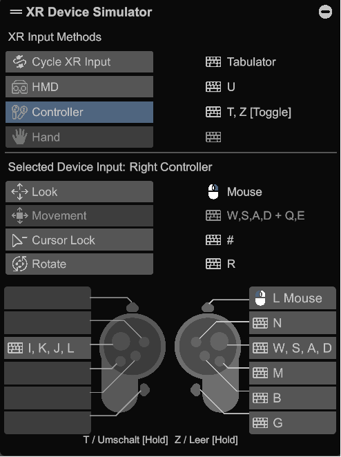

## Unity setup hints
* For local Gothic installation directory, please create file _GameSettings.dev.json_ next inside _Assets/StreamingAssets_. This file is ignored by git and you need to set its values to make the game run in Unity.
* Load scene "Bootstrap" in your Editor. Hit play and you're good to go.
* You can configure the runtime through a _GameConfiguration_ scriptable object (see below).

## GameConfiguration
* One for _Production_ is set by default
* You can create your own by:
  * Navigating to the `Gothic-UnZENity-Core/Resources/GameConfigurations` directory in Unity
  * creating a new _GameConfiguration_ object via `Right Click > Create > ScriptableObjects > GameConfiguration`
  * dragging it into the _"Config"_ inspector-slot of the _GameManager_ scene object
* Can be edited in the inspector by either selecting it in the file view, or double-clicking its field in the Inspector

## Updating Unity or packages

**Updating _XR Interaction Toolkit_**  
_XRI Default Input Actions.inputactions_ are put from the Samples folder into _Assets/GothicVR/XR Interaction Toolkit/_.
This ensures (e.g.) velocity handling for Climbing ladders persists after updates. Nevertheless, after an update, it needs to be rechecked.

Update hints from Unity: [Starter Assets](https://docs.unity3d.com/Packages/com.unity.xr.interaction.toolkit@2.5/manual/samples-starter-assets.html)

## XR Device Simulators

**HVR:**

Hurricane VR has a community made plugin to explore the game via WASD (https://github.com/AdrielCodeops/HurricaneVR-Extensions).
To activate it, you need to set _Game Controls_ to _HVR_ and _Use XR Device Simulator_ to _true_ inside feature flags.

Please check this video to get more details about how it can be used:
https://www.youtube.com/watch?v=-LRJt0cD4xk

**XRIT:**

You can play the game with [OpenXR's control simulator](https://docs.unity3d.com/Packages/com.unity.xr.interaction.toolkit@2.4/manual/xr-device-simulator-overview.html).
This enables you to test without setting up your HMD.
It needs to be activated via FeatureFlag _Use XR Device Simulator_ and is implemented to run in Editor mode only.

We're using the default controls which are:

**HMD (No specific controller activated)**  

**Left controller**  

**Right controller**  

