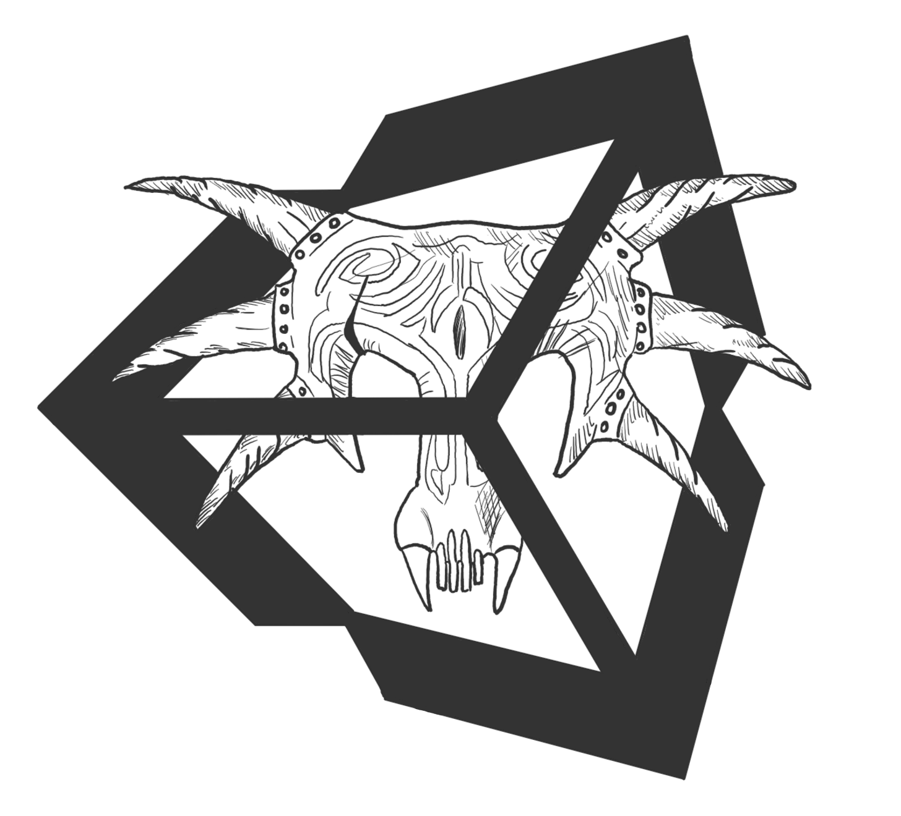
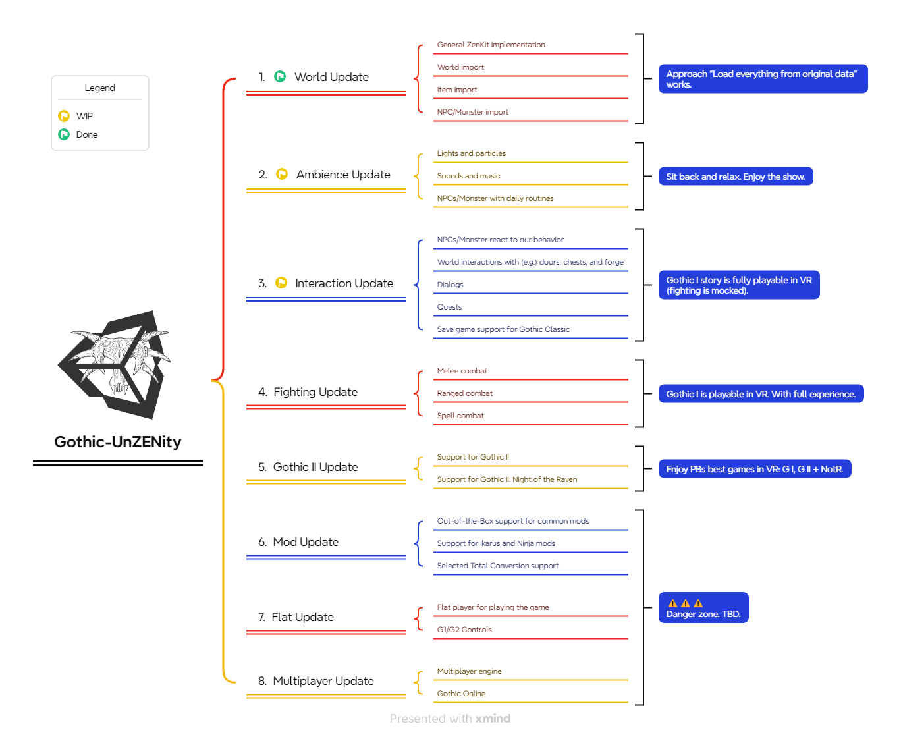
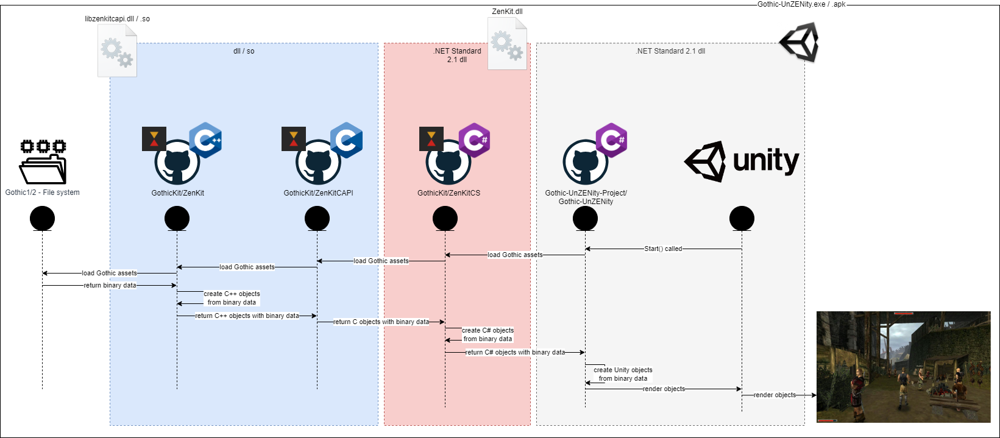

# Gothic-UnZENity

  

Community rebuild of classical Gothic 1 and 2 in Unity engine. Currently focusing on a native VR implementation.

## Usage
> [!NOTE]
> For instructions on playing the game or adding contributions, please check our [Wiki](https://github.com/Gothic-UnZENity-Project/Gothic-UnZENity/wiki).

> [!TIP]
> 🤫 Shortcut to the installation instructions is [here](https://github.com/Gothic-UnZENity-Project/Gothic-UnZENity/wiki/Player%27s-Guide#setup). You can thank me later. 😉

## Roadmap

(You'll find our current feature development status at the [Projects](https://github.com/Gothic-UnZENity-Project/Gothic-UnZENity/projects?query=is%3Aopen) page.)

## Our Tenets (until you know better ones)
1. We preserve native Gothic experience -  To achieve it we will import original Gothic assets from local installations. Dynamically and during runtime. Do you still remember Bloodwyn forcing you to pay your protection money? You'll experience it again. And you'll pay... We promise!
2. We add best in class VR mechanics - VR offers new ways of being immersed into the world of Gothic. How about crafting a blade with your hammer blow, drawing a two-handed weapon from your left shoulder, or casting a spell with hand gestures? You dream it, we build it.
3. We will put enhancements to original Gothic data wherever useful - The original Gothic games were built when computers weren't this beefy. 25 years later, it changed. We think of adding more details like additional grassy grass to the Barrier or muggy mugs inside the Old Camp.
4. We will adopt all of Piranha Bytes' ZenGine games - But first things first. Let's start with a full playable Gothic 1 port, followed by Gothic 2 and it's addon NotR.
5. We just can't get enough! - Once done with the original experiences we will add other game modes and support for mods, and total conversions. How about a coop Scavenger hunt with your friends? Wouldn't this be amazing? And how about re-experiencing a few of your most beloved community mods in VR? Yes. We feel the same. <3

## How to contribute
If you're interested in Core Unity development, C# coding, or you're seasoned with VR game mechanics development, feel free to look at [CONTRIBUTING.md](./CONTRIBUTING.md). There you find information on how to create fixes, features, or join us as a core maintainer.

## Workflow/Gameflow

1. Gothic-UnZENity requests data from ZenKit.dll (.net standard 2.1 shared library which is cross-OS compatibel).
2. The dll itself forwards request to libzenkitcapi.dll/.so as it includes the original ZenKit parser library.
3. ZenKitCAPI loads the file system data.
4. The data is then returned to Unity to build Unity C# objects like Meshes.

## Dependencies
Gothic-UnZENity is using the following projects:
* [GothicKit/ZenKit](https://github.com/GothicKit/ZenKit) - Gothic asset parser
* [GothicKit/dmusic](https://github.com/GothicKit/dmusic) - Open Source reimplementation of DirectMusic.

## Credits
Big shoutout towards
* [ZenKit](https://github.com/GothicKit/ZenKit) - Our single source of truth for parsing Gothic assets at runtime.
* [OpenGothic](https://github.com/Try/OpenGothic) - Our reliable inspiration and code support on how to rebuild the classic Gothic games.

## FAQ

**Q: There are already a few recreations of Gothic in other game engines. What are Gothic-UnZENity's USPs?**  
A: In a nutshell:
1. We provide a native VR experience for Gothic (Unity Engine and its great VR support helps us a lot)
2. Game data is loaded 100% from local Gothic installation(s),
3. Therefore we are compatible with Mods and Total Conversions (dependent on used features).
4. We build our Gothic engine in a modularized way, which means
5. In the future we might offer more capabilities like Flat and Multiplayer support (Nevertheless it’s way too early for this. Don’t quote us on it ;-) )

**Q: Why do you use an external framework to parse Gothic assets?**  
A: ZenKit is a full Gothic asset parser. It is feature complete and works with Gothic1, Gothic2, and Gothic2 the Night of the Raven assets. Last but not least, it's already used by OpenGothic as another reimplementation of Gothic Classic. Why reinventing the wheel? ¯\_(ツ)_/¯

**Q: What an interesting project name...**  
A: We're glad you asked! _Gothic-UnZENity_ is a combination of Gothic, Unity, Zen (original 3D engine for Gothic I/II Classic), unleash, and a grain of insanity. ;-)
