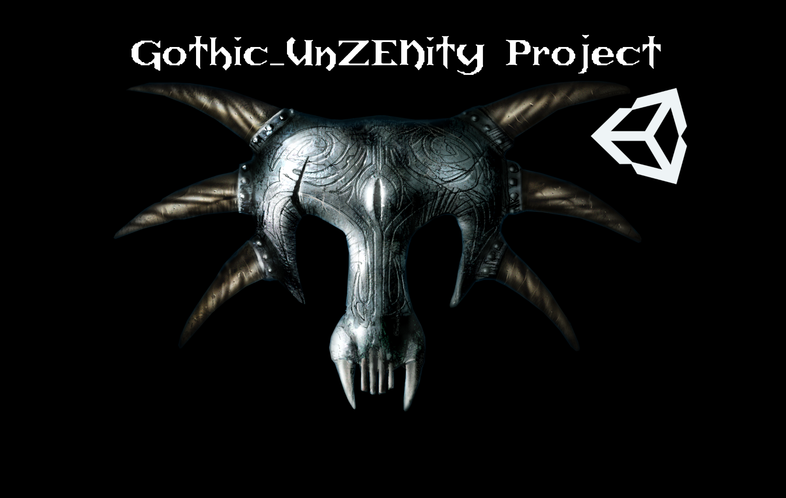
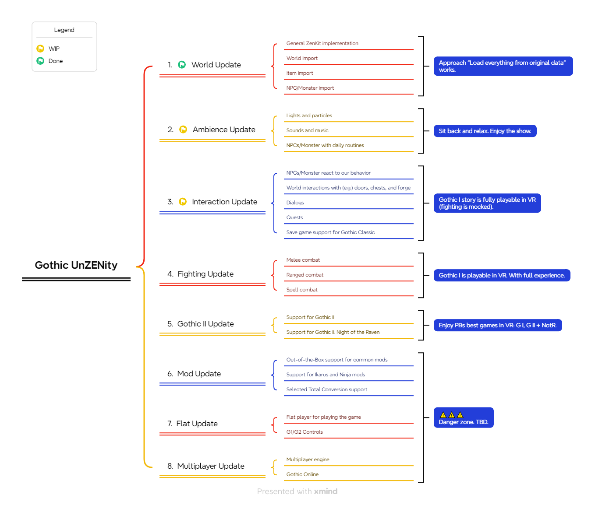
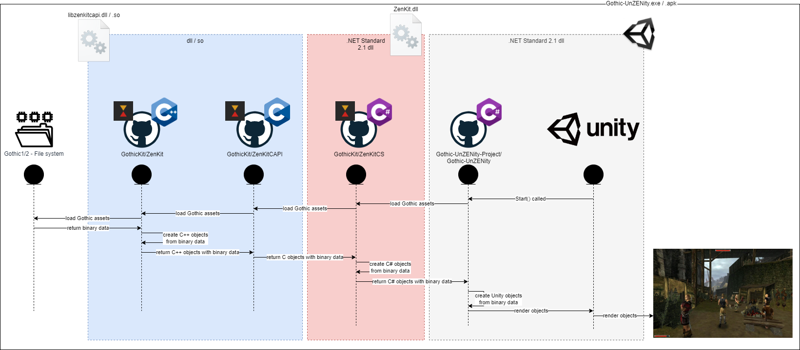

# Gothic-UnZENity

  

Fan project recreating Piranha Bytes' evergreens Gothic I and Gothic II in Unity Engine. Currently focussing on VR.

## Usage
For instructions on playing the game or adding contributions, please check our [Docs](Docs).

(🤫 Shortcut to the installation instructions: [here](Docs/setup/player.md). Thank me later. 😉)

## Roadmap

## Our Tenets (until you know better ones)
1. We preserve native Gothic experience -  To achieve it we will import original Gothic assets from local installations. Dynamically and during runtime. Do you still remember Bloodwyn forcing you to pay your protection money? You'll experience it again. And you'll pay... We promise!
2. We add best in class VR mechanics - VR offers new ways of being immersed into the world of Gothic. How about crafting a blade with your hammer blow, drawing a two-handed weapon from your left shoulder, or casting a spell with hand gestures? You dream it, we build it.
3. We will put enhancements to original Gothic data wherever useful - The original Gothic games were built when computers weren't this beefy. 20 years later, it changed. We think of adding more details like additional grassy grass to the Barrier or muggy mugs inside the Old Camp.
4. We will adopt all of Piranha Bytes' ZenGine games - But first things first. Let's start with a full playable Gothic 1 port, followed by Gothic 2 and it's addon NotR.
5. We just can't get enough! - Once done with the original experiences we will add own VR game modes and support for mods, and total conversions. How about a coop Scavenger hunt with your friends? Wouldn't this be amazing? And how about re-experiencing a few of your most beloved community mods in VR? Yes. We feel the same. <3

## How to contribute
If you're interested in Core Unity development, C# coding, or you're seasoned with VR game mechanics development, feel free to look at [CONTRIBUTING.md](./CONTRIBUTING.md). There you find information on how to create fixes, features, or join us as a core maintainer.

## Workflow/Gameflow

1. Gothic-UnZENity requests data from ZenKit.dll (.net standard 2.1 shared library which is cross-OS compatibel).
2. The dll itself forwards request to libzenkitcapi.dll/.so as it includes the original ZenKit parser library.
3. ZenKitCAPI loads the file system data.
4. The data is then returned to Unity to build Unity C# objects like Meshes.

## Dependencies
Gothic-UnZENity is using the following projects:
* [GothicKit/ZenKit](https://github.com/GothicKit/ZenKit) - Gothic asset parser
* [GothicKit/dmusic](https://github.com/GothicKit/dmusic) - Open Source reimplementation of DirectMusic.

## Credits
Big shoutout towards
* [ZenKit](https://github.com/GothicKit/ZenKit) - Our single source of truth for parsing Gothic assets at runtime.
* [OpenGothic](https://github.com/Try/OpenGothic) - Our reliable inspiration and code support on how to rebuild the classic Gothic games.

## FAQ

**Q: Why do you use an external framework to parse Gothic assets?**  
A: ZenKit is a full Gothic asset parser and already used by OpenGothic. It is feature complete and works with Gothic1, Gothic2, and Gothic2 the Night of the Raven assets. Why reinventing the wheel? ¯\_(ツ)_/¯

**Q: Why do you integrate ZenKit as shared library (DLL) instead of using its code directly?**  
A: As ZenKit is written in C++, we need a way to communicate with C#. The way to go is shared libraries as they can be used within C# via _DllImport_.

**Q: What an interesting project name...**  
A: We're glad you asked! We chose the name _Gothic-UnZENity_ as our goal is to preserve Gothic in its classical form for modern systems and play types.
It's a combination of Gothic, Unity, Zen (original 3D engine for Gothic I/II Classic), unleash, and a grain of insanity. ;-)
